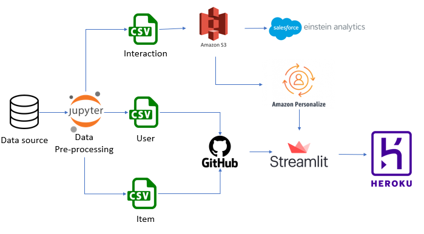

Website Link: https://bankrecommendation.herokuapp.com/

# Introduction
# Santander Product Recommendation System
Our goal is to implement a product recommendation system based on user personalization and item-similarity, to help banks improve customer acquisition and revenue on products by better marketing techniques.

# Dataset
For this, we utilized the Santander Product Recommendation dataset which is available on Kaggle. 

Link - https://www.kaggle.com/c/santander-product-recommendation/data

The dataset contains 1.5 years of Spain customers behavior data from Santander bank to predict what new products customers will purchase. The data starts at 2015-01-28 and has monthly records of products a customer has, such as "credit card", "savings account", etc. Our goal is to recommend products based on customer interactions. The dataset contains around 200K rows and 49 columns.

# Architecture

# Visualization
.png)

# Algorithms
## User-Personalization recipe
Predicts items a user will interact with and performs exploration on cold items. Based on Hierarchical Recurrent Neural Networks which model the temporal order of user-item interactions.
## Item-to-item similarities (SIMS)
Computes items similar to a given item based on co-occurrence of items in the user-item interactions dataset.  

Google Docs link - https://docs.google.com/document/d/16-FVvnGGofMyUECas5j-cwEtVn_Xt7cwE4WYhMOK97c/edit#heading=h.k5kw41q84yog

Codelab link - https://codelabs-preview.appspot.com/?file_id=16-FVvnGGofMyUECas5j-cwEtVn_Xt7cwE4WYhMOK97c#0

Youtube video link - https://www.youtube.com/watch?v=QJtb06cH_Ms

# References

https://docs.aws.amazon.com/personalize/latest/dg/native-recipe-sims.html

https://docs.aws.amazon.com/personalize/latest/dg/native-recipe-new-item-USER_PERSONALIZATION.html

https://databricks-prod-cloudfront.cloud.databricks.com/public/4027ec902e239c93eaaa8714f173bcfc/2885002711960994/97004730824646/7533496735645217/latest.html

